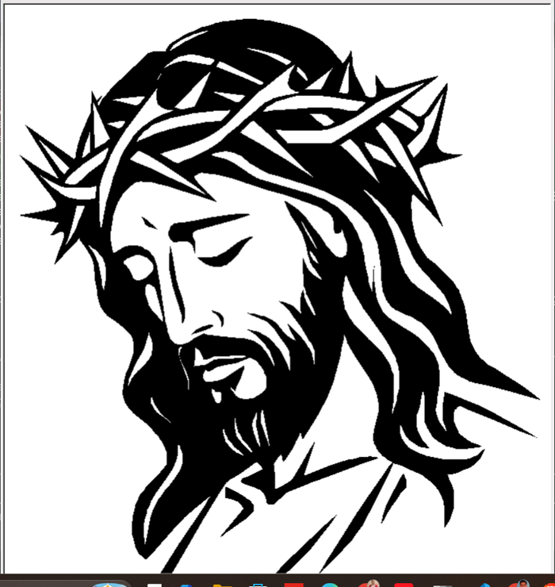
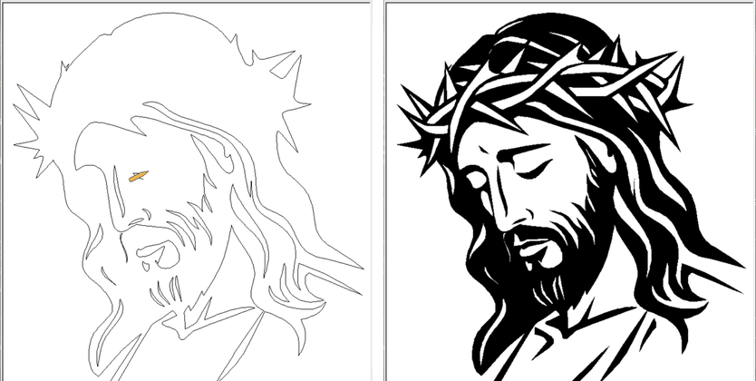
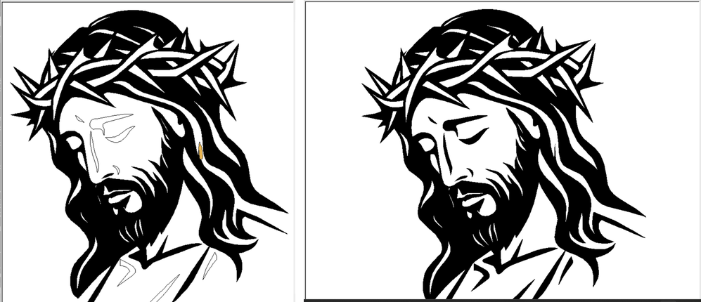
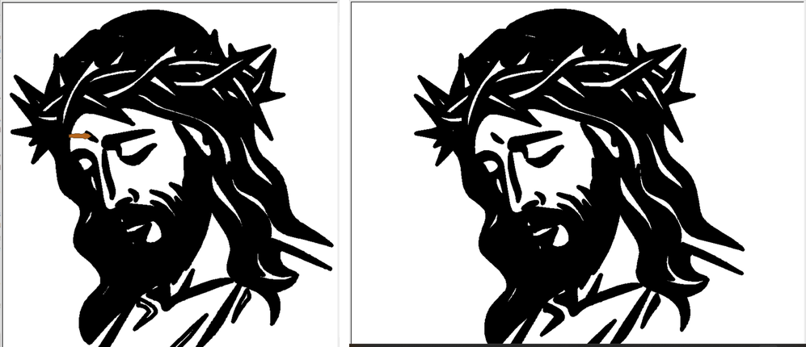
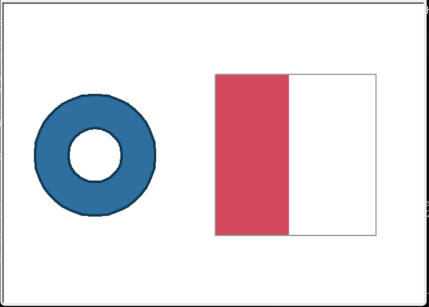

# Universal SVG Turtle Renderer

Render SVG artwork with Python's Turtle Graphics — accurately enough that the
result looks like the original, not like a tracing of it.

```bash
python main.py artwork.svg
```



*`assets/sample.svg` — a single path of 61 rings, 2,670 vertices, drawn by turtle
in 11 ms. Pixel-identical to an independent nonzero-winding rasteriser.*

---

## Contents

- [Why this exists](#why-this-exists)
- [Features](#features)
- [Installation](#installation)
- [Usage](#usage)
- [CLI reference](#cli-reference)
- [Pencil sketch mode](#pencil-sketch-mode)
- [Supported SVG features](#supported-svg-features)
- [Architecture](#architecture)
- [The rendering pipeline](#the-rendering-pipeline)
- [Two problems worth explaining](#two-problems-worth-explaining)
- [Performance](#performance)
- [Known limitations](#known-limitations)
- [Testing](#testing)
- [Roadmap](#roadmap)
- [Contributing](#contributing)
- [License](#license)

---

## Why this exists

Turtle is a teaching toy: it draws straight lines, has no alpha channel, no fill
rules, and no concept of a curve. SVG is a full vector format. Most "SVG in
turtle" scripts bridge that gap by ignoring it — they sample a handful of points
per path, skip transforms, and assume every shape has a flat `fill` attribute.
They work on the one file the author tested.

This is the other approach: parse the SVG properly, resolve it into geometry, and
then meet turtle's limitations deliberately and in the open. Curves are flattened
adaptively to a sub-pixel tolerance. Transforms are composed and baked in.
Transparency is composited against the background. Nonzero fill is translated into
something an even-odd backend can actually draw.

## Features

- **Full path grammar** — every command (`M m L l H h V v C c S s Q q T t A a Z z`),
  including implicit repeats, unseparated arc flags (`a1 1 0 011 1`), and
  specification-conformant error recovery.
- **Adaptive curve flattening** — subdivision by flatness, not a fixed step count,
  so curves get the vertices they need and no more.
- **Real transforms** — `matrix`, `translate`, `scale`, `rotate`, `skewX`, `skewY`,
  composed through nested groups and baked into the geometry.
- **Correct fill rules** — both `nonzero` (SVG's default) and `evenodd`.
- **Full colour syntax** — hex (3/4/6/8 digit), `rgb()`, `rgba()`, `hsl()`, `hsla()`,
  modern space-separated syntax, all 147 CSS named colours, `currentColor`.
- **Alpha compositing** — `opacity`, `fill-opacity` and `stroke-opacity` flattened
  onto the page colour, since turtle has no alpha.
- **`<use>`, `<defs>`, `<symbol>`** — including `xlink:href`, per-instance styling,
  and cycle detection.
- **Pencil and brush sketch modes** — watch a pencil trace the artwork from a
  blank canvas at a steady hand-speed with the colour streaming in behind it, or
  switch to a brush that lays down thick strokes and paints the fill in visible
  courses.
- **Auto-fit** — aspect-preserving scale-to-canvas, centring, margins, rotation,
  mirror and flip.
- **Themes and colour modes** — original, monochrome, random; five presets.
- **Export** — PNG (via Ghostscript, or a screen grab, or EPS as a last resort).
- **Performance tools** — Douglas–Peucker simplification, pen-travel ordering,
  adjustable curve resolution, progress bars, statistics.

## Installation

Requires **Python 3.10+** and **tkinter** (which turtle needs).

```bash
git clone https://github.com/bhanuka/svg-turtle-renderer.git
cd svg-turtle-renderer
pip install -e .
```

Or run straight from the checkout with no install at all:

```bash
python main.py artwork.svg
```

<details>
<summary>tkinter is missing</summary>

| Platform | Fix |
| --- | --- |
| Debian / Ubuntu | `sudo apt install python3-tk` |
| Fedora | `sudo dnf install python3-tkinter` |
| macOS (Homebrew) | `brew install python-tk` |
| Windows | Included with the python.org installer |

</details>

Optional extras:

```bash
pip install -e ".[export]"   # Pillow, for PNG export
pip install -e ".[dev]"      # pytest, ruff, mypy
```

PNG export additionally wants [Ghostscript](https://www.ghostscript.com/) —
see [Export](#export-notes).

## Usage

```bash
# Automatic fit, drawn instantly
python main.py artwork.svg

# Watch a pencil draw it from a blank canvas
python main.py artwork.svg --sketch

# Paint it with a brush instead, taking exactly 45 seconds however big it is
python main.py artwork.svg --brush --duration 45

# Sketch in graphite
python main.py artwork.svg --sketch --pencil-color '#555'

# Watch it draw, on a dark background, and save the result
python main.py artwork.svg --animate --fps 60 --theme dark --export out.png

# Outlines only, one colour, on a large canvas
python main.py map.svg --wireframe --width 1400 --height 900

# Frame the artwork itself rather than the viewBox, zoom in, nudge it up
python main.py logo.svg --fit content --scale 2.5 --offset-y 40

# Fastest possible render of a very large file
python main.py huge.svg --simplify 0.5 --resolution 0.5 --no-progress
```

As a library:

```python
from svg_turtle_renderer import RenderConfig, RenderEngine

engine = RenderEngine(RenderConfig(input_path="artwork.svg", theme="dark"))
stats = engine.run()
print(stats.format_report())
```

Rendering headless — no window — by injecting a canvas:

```python
from svg_turtle_renderer.renderer.canvas import RecordingCanvas

canvas = RecordingCanvas()
engine = RenderEngine(config, canvas_factory=lambda background: canvas)
engine.run()
print(len(canvas.fills), "fills,", len(canvas.strokes), "strokes")
```

## CLI reference

| Flag | Default | Meaning |
| --- | --- | --- |
| `INPUT.SVG` | — | The file to render (positional) |
| `--config FILE.JSON` | — | Load settings from JSON; flags still win |
| **Canvas** | | |
| `--width N` | `1000` | Window width in pixels |
| `--height N` | `800` | Window height in pixels |
| `--fullscreen` | off | Use the whole screen |
| `--background`, `--bg` | `white` | Page colour, any supported notation |
| `--theme NAME` | — | `dark`, `light`, `blueprint`, `sepia`, `neon` |
| **Framing** | | |
| `--scale N\|auto` | `auto` | Scale factor, or fit automatically |
| `--fit viewbox\|content` | `viewbox` | Frame the viewBox or the artwork's bounds |
| `--margin PX` | `20` | Padding when fitting |
| `--offset-x PX`, `--offset-y PX` | `0` | Nudge (y is positive-up) |
| `--rotate DEG` | `0` | Rotate clockwise |
| `--mirror`, `--flip` | off | Mirror horizontally / flip vertically |
| **Paint** | | |
| `--fill` / `--no-fill` | on | Paint fills |
| `--stroke` / `--no-stroke` | on | Paint strokes |
| `--wireframe` | off | Outlines only, ignoring the document's paint |
| `--color-mode MODE` | `original` | `original`, `mono`, `random` |
| `--mono-color COLOR` | `black` | Colour for mono and wireframe |
| **Drawing** | | |
| `--speed 0-10` | `0` | Turtle's own pen speed; 0 is instant |
| `--animate` | off | Draw progressively at `--fps` |
| `--fps N` | `30` | Frames per second while animating |
| `--hide-turtle` / `--no-hide-turtle` | on | Hide the cursor when finished |
| `--keep-open` / `--no-keep-open` | on | Wait for a click before closing |
| **Sketch** | | |
| `--sketch` | off | Draw from a blank canvas, tracing each outline first |
| `--brush` | off | Sketch with a brush: thick strokes and brush-row fills |
| `--sketch-tool pencil\|brush` | `pencil` | The drawing tool |
| `--pencil-speed PX` | `900` | Tool speed, in pixels per second |
| `--duration SEC` | — | Finish in this long, whatever the drawing's size |
| `--pencil-color COLOR` | — | Pencil colour; default traces each shape's own ink |
| `--pencil-width PX` | `1` | Pencil line width |
| `--brush-width PX` | `9` | Brush stroke width |
| `--show-pencil` / `--no-show-pencil` | on | Show the drawing cursor |
| `--fill-flow` / `--no-fill-flow` | on | Stream fills in instead of applying at once |
| **Quality** | | |
| `--resolution N` | `1.0` | Curve smoothness; higher is smoother, slower |
| `--simplify PX` | `0` | Drop vertices within this many pixels of the line |
| `--optimize-order` | off | Reorder shapes to shorten pen travel |
| **Output** | | |
| `--export`, `-o FILE` | — | Save the canvas |
| `--stats` | off | Print statistics |
| `--no-show-progress` | — | Hide the progress bar |
| `--strict` | off | Fail on malformed SVG instead of recovering |
| `-v`, `-q` | — | Verbose / quiet logging |

Exit codes: `0` success, `1` render error, `2` bad usage, `130` interrupted.

## Supported SVG features

| Area | Supported | Not supported |
| --- | --- | --- |
| Shapes | `path`, `rect` (incl. `rx`/`ry`), `circle`, `ellipse`, `line`, `polygon`, `polyline` | `text`, `image` |
| Structure | `g`, `svg`, `a`, `defs`, `use`, `symbol`, `switch` | nested `svg` viewports |
| Path data | all commands, implicit repeats, packed arc flags | — |
| Transforms | `matrix`, `translate`, `scale`, `rotate`, `skewX`, `skewY` | — |
| Paint | flat colours, `fill-rule`, opacity | gradients, patterns |
| Colour | hex 3/4/6/8, `rgb()`, `rgba()`, `hsl()`, `hsla()`, named, `currentColor` | `color-mix()`, `lab()`, `lch()` |
| Styling | presentation attributes, inline `style` | `<style>` sheets, class selectors |
| Clipping | `clipPath` (to its bounding box) | exact outlines, `mask` |
| Strokes | colour, width | `stroke-dasharray`, `linecap`, `linejoin` |

Unsupported constructs are skipped with a warning rather than guessed at. A
`fill="url(#gradient)"` shape is left unpainted, because painting it some
arbitrary flat colour would be a silent lie.

## Architecture

Layers depend strictly downward. Nothing below the renderer imports `turtle`;
nothing below the parser knows what XML is.

```
       cli.py ──────────► core/config.py      (flags, themes, validation)
          │
          ▼
    core/engine.py ─────► core/model.py       (Drawing, Shape, SubPath, Style)
      │        │
      │        └────────► core/exceptions.py
      ▼
  ┌───────────────┬────────────────────┬─────────────────┐
  │   parser/     │     geometry/      │    renderer/    │
  │               │                    │                 │
  │ svg_parser    │ coordinate_system  │ canvas  (proto) │
  │ path_parser   │ bezier             │ turtle_renderer │
  │ color_parser  │ scaler   polyline  │ path_renderer   │
  │ transform_... │ clipping banding   │ animation       │
  │               │ fill_rule scanline │                 │
  └───────────────┴────────────────────┴─────────────────┘
                           │
                           ▼
                  utils/ (logger, helpers)
```

The seam that matters is `renderer/canvas.py`. `PathRenderer` draws against a
`Canvas` **protocol**, never against turtle directly, so the entire pipeline runs
headless against a `RecordingCanvas`. That is why 596 of the 597 tests need no
display.

## The rendering pipeline

```
 artwork.svg
     │
     ▼
 ┌─────────┐  XML ──► elements, inherited style, composed transforms
 │  parse  │  curves ──► polylines (adaptive, tolerance from the viewBox)
 └─────────┘  paint ──► RGB + alpha
     │            output: Drawing (user units, absolute coordinates)
     ▼
 ┌─────────┐  viewBox or content bounds ──► one matrix:
 │   fit   │  centre → scale → mirror/flip → rotate → y-flip → offset
 └─────────┘
     │
     ▼
 ┌─────────┐  every vertex mapped to canvas pixels
 │transform│  stroke widths scaled by sqrt(|det|)
 └─────────┘
     │
     ▼
 ┌─────────┐  optional: Douglas–Peucker simplify, nearest-neighbour ordering
 │ prepare │
 └─────────┘
     │
     ▼
 ┌─────────┐  fill rule ──► even-odd groups
 │  draw   │  alpha ──► composited onto the background
 └─────────┘  fill, then stroke, in document order
     │
     ▼
   window ──► optional PNG
```

## Pencil sketch mode

```bash
python main.py artwork.svg --sketch --duration 30
```



*Mid-sketch, with the pencil at the tip of the line it is drawing — and the same
drawing once it finishes and fills in.*

The pencil traces every shape's outline, then the colour streams in behind it, so
the drawing appears the way someone would actually make it: line first, ink after,
and neither one snapping into place. Three details make it read as drawing rather
than as a progress bar.

**It paces by distance, not by vertices.** A flattened curve packs vertices
tightly while a straight edge has two. Advancing a fixed number of *vertices* per
frame would make the pencil crawl around curves and then teleport across a long
line. `geometry/polyline.py` walks the outline at a fixed number of *pixels* per
frame, subdividing long segments as it goes, which gives a steady hand-speed.

**It traces the geometry, not the stroke.** A fill-only shape — like the sample
artwork, which is one big black path with no `stroke` at all — has no outline to
follow. Sketch mode draws its edge anyway, or there would be nothing to watch.

**The fill flows in; it does not appear.** Turtle fills a whole polygon in one
operation, so a colour that simply switched on would undo the illusion the moment
the outline finished. Instead the shape is clipped to a horizontal front that
sweeps down it, and each strip is filled in turn (`geometry/banding.py`).



*The colour front partway down the face, and the finished drawing. The banded
fill is pixel-identical to filling the shape in one go, verified against an
independent rasteriser; only the timing differs.*

Streaming is on by default for a sketch; `--no-fill-flow` reverts to a single
snap fill. The strips overlap by half a pixel, because abutting opaque strips can
otherwise leave a hairline seam where the backend antialiases their shared edge.

**The brush is a different tool, not just a thicker pencil.** `--brush` traces the
outline in thick coloured strokes and then paints the fill in visible horizontal
courses rather than clipped bands: each row is a wide stroke drawn only across the
parts of that scanline inside the shape (`geometry/scanline.py`), so holes stay
open and the paint goes on the way a brush lays it down.



*The brush mid-course, the paint sweeping down over the traced outline, and the
finished piece. Unlike the banded pencil fill this is not pixel-identical to a
plain fill — the strokes are meant to read as brushwork — but it covers the shape
completely, the rows spaced closer than the brush is wide so none show through.*

`--duration` solves for the speed from the total distance the pencil and the fill
front cover together, so a drawing takes the time you asked for whatever its size.
It accounts for the fact that each outline and each fill band ends in a partial
frame; on the sample ignoring that overhead made a 2-second request take 3.1
seconds. There is a floor — one frame per outline and per fill — and asking for
less says so rather than quietly running long:

```
$ python main.py assets/sample.svg --sketch --duration 1
WARNING  --duration 1s is shorter than this drawing can be sketched. It needs at
         least 2.4s at 30 fps, because each of its 72 outlines and fills costs a
         frame. Raise --fps, or ask for longer.
```

`--sketch` and `--animate` are different effects and do not combine: `--animate`
reveals finished shapes at a frame rate, `--sketch` draws them. Both switch
turtle's own per-move animation off, since only one thing can pace the screen.

The progress bar follows suit and measures pencil travel rather than shapes, so
it moves smoothly and gives a real ETA — a sketch is often one path drawn over a
minute, and counting shapes would report `0/1` throughout:

```
Sketching:  57%|#####6    | 10.6k/18.8k [00:01<00:01, 5.06kpx/s]
```

## Two problems worth explaining

Both of these are the difference between artwork that looks right and artwork
that looks broken, and neither is obvious.

### Fill rules

SVG's default fill rule is **nonzero**: a region is filled when its winding number
isn't zero. Tk fills **even-odd**. They agree on a donut and disagree badly on
real artwork — where same-direction rings overlap, even-odd cancels them into
holes and the drawing chequerboards.



*Left: a compound path's hole, cut correctly. Right: `clipPath` cropping.*

`geometry/fill_rule.py` bridges this. It computes each ring's winding number,
identifies which rings are genuinely holes, and groups every filled ring with the
holes directly inside it. Each group is filled separately, so overlaps union
(as nonzero requires) while holes still get cut (because even-odd cuts them
within a group).

### Stitching rings into one polygon

Tk fills one polygon per call, so a compound path's rings must be stitched into a
single point list — and the stitching must not paint anything itself.

The tempting approach walks the rings in a chain, `A → B → C`, letting the fill
close `C → A`. With **two** rings this looks perfect: the single bridge and the
closing edge lie on top of each other and cancel. With **three or more** the
bridges form a polygon of their own, and its edges flip the parity of everything
they enclose.

So rings are reached by a *spoke* out from a shared hub and left by the same spoke
back. Every bridge is traversed twice in opposite directions and cancels exactly.
This is the kind of bug that passes a donut test and then chequerboards a
60-ring drawing, which is why there is a regression test aimed squarely at it.

## Performance

Measured on a synthetic 640 KB file: 3,000 paths, 12,000 cubic segments,
~150,000 vertices after flattening. Python 3.14, Windows 11, 1000×1000 canvas.

| Stage | Default | `--simplify 0.5` |
| --- | --- | --- |
| Parse + flatten | 359 ms | 355 ms |
| Fit + transform | 37 ms | 237 ms |
| Turtle rendering | 1.59 s | 1.07 s |
| **Total** | **4.17 s** | **1.84 s** |
| Vertices | 149,801 | 80,920 |

Notes:

- Turtle rendering dominates, and it scales with vertex count — which is what
  `--simplify` and `--resolution` exist to control. `--simplify 0.5` halves the
  vertices for a sub-pixel visual difference.
- Simplification costs time to save time; it pays off once turtle is the
  bottleneck, which is any file of real size.
- Curve tolerance is derived from the viewBox diagonal, so `--resolution` means
  the same thing regardless of the document's units. See `estimate_tolerance`.

Reproduce with `--stats` on your own file.

## Known limitations

Ordered by how likely they are to bite.

1. **No text.** `<text>` is skipped. Convert text to paths in your editor
   (Inkscape: *Path → Object to Path*).
2. **No gradients or patterns.** Turtle fills flat colours only. Shapes painted
   with a paint server are left unpainted rather than faked.
3. **No CSS stylesheets.** Presentation attributes and inline `style="…"` are
   honoured; `<style>` blocks and class selectors are not.
4. **`clipPath` is approximate** — shapes are clipped to the clip path's bounding
   box, not its true outline. Rectangular clips (the common case) are exact.
5. **Group opacity is approximated.** It is folded into each descendant's alpha
   instead of compositing the group as a unit. The difference only shows where
   members of a group overlap.
6. **Transparency is faked.** Turtle has no alpha, so translucent paint is
   composited against the *page* colour. Exact for isolated shapes; approximate
   where artwork overlaps.
7. **Non-uniform stroke scaling.** A stroke under a non-uniform transform should
   become elliptical; turtle can't, so `sqrt(|det|)` is used — the SVG
   specification's own fallback.
8. **No stroke styling.** `stroke-dasharray`, `linecap` and `linejoin` are ignored.
9. **One window per process** is the intended usage, though reopening works.

### Export notes

Tk can only export PostScript, so `--export out.png` tries, in order:

1. **Pillow + Ghostscript** — a true render of the vector canvas. Best quality.
2. **Screen grab** — no Ghostscript needed, but it captures the window's actual
   pixels, so anything overlapping it appears in the image, and the window must
   fit on screen.
3. **`.eps`** — the drawing is never silently lost.

Install Ghostscript for route 1.

## Testing

```bash
pytest                    # 597 tests, no display needed, ~4 s
pytest -m display -s      # window smoke test (needs a screen)
python scripts/smoke_render.py   # multi-window end-to-end checks
```

Coverage is 89%. The pipeline is tested against the `Canvas` protocol rather than
a real window, so the default suite is fast and deterministic.

Display tests are deselected by default and run with `-s`. This is not squeamishness:
Tk is unreliable when one process creates many interpreters, and pytest's
file-descriptor capture makes Tcl's initialisation fail spuriously. Those paths
are covered by `scripts/smoke_render.py` instead, which a plain script handles
fine. See `CONTRIBUTING.md`.

## Roadmap

- [ ] `<text>` via font outline extraction
- [ ] Gradient approximation by banding
- [ ] Exact `clipPath` outlines (polygon boolean operations)
- [ ] CSS stylesheet and selector support
- [ ] `stroke-dasharray`
- [ ] GIF export of the drawing animation
- [ ] Pause / resume and zoom / pan controls

## Contributing

See [CONTRIBUTING.md](CONTRIBUTING.md). Please read
[CODE_OF_CONDUCT.md](CODE_OF_CONDUCT.md) too.

## License

MIT — see [LICENSE](LICENSE).
